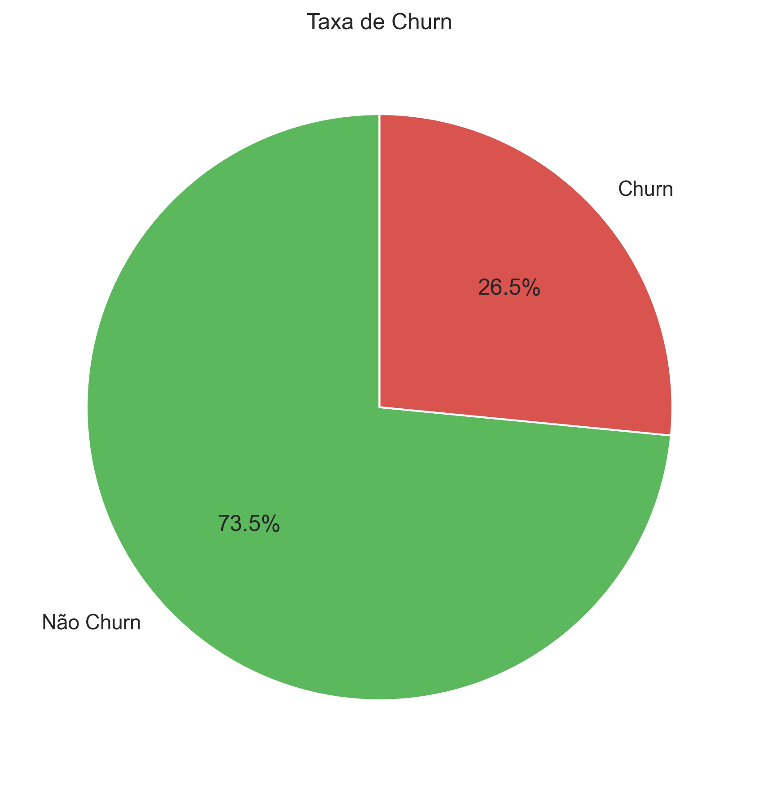
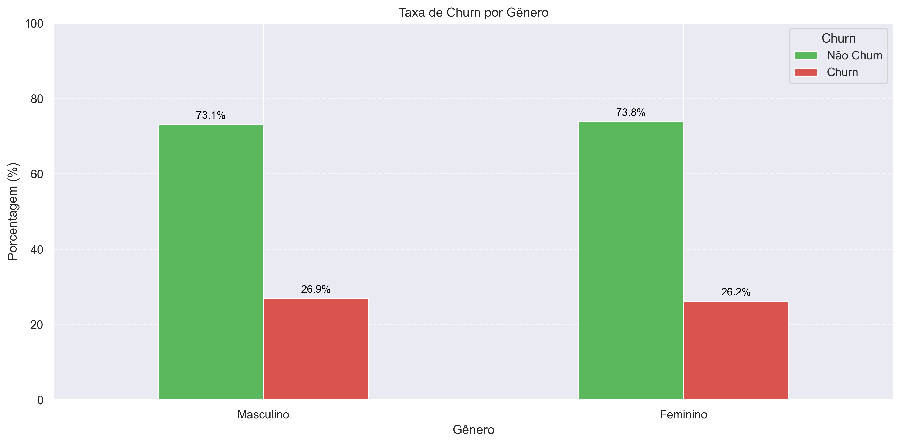
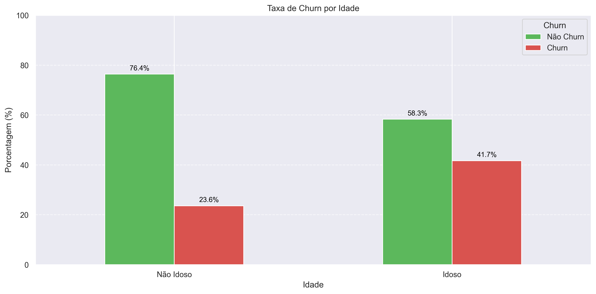
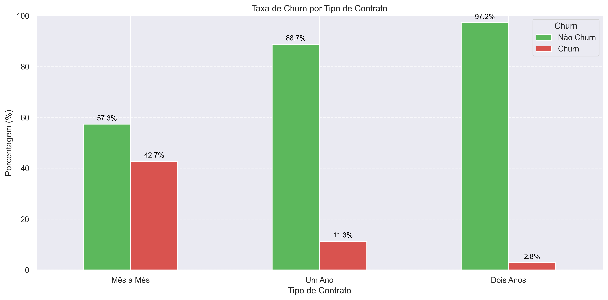
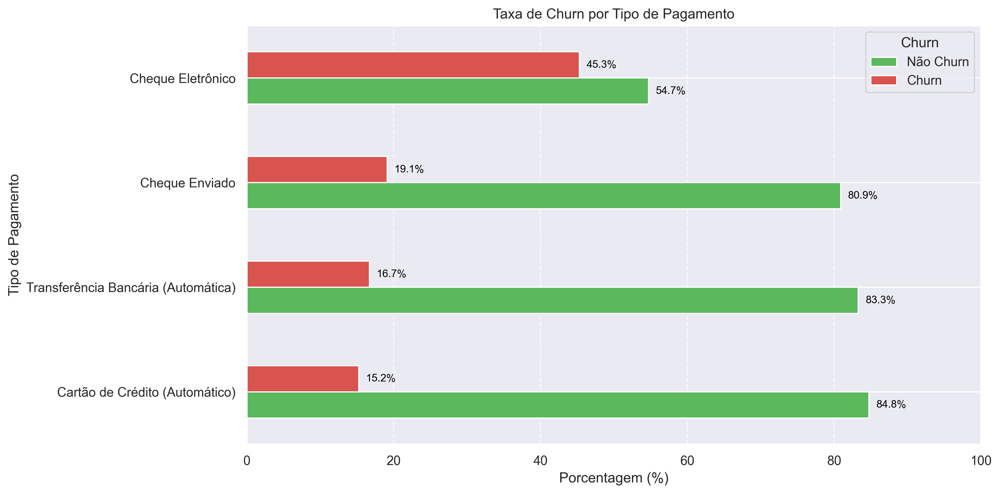
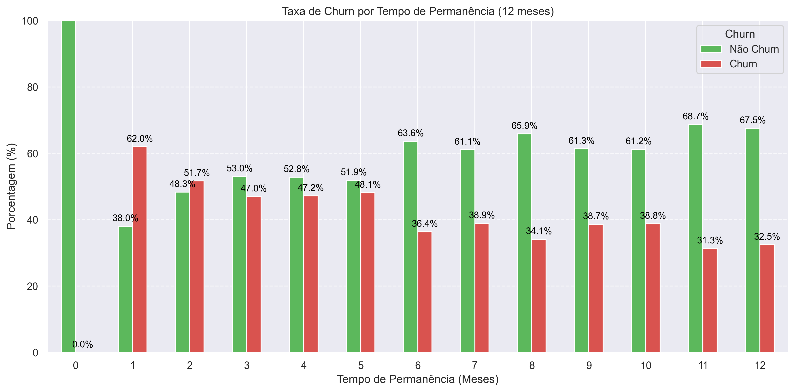

# 📄 Relatório Final — Análise de Churn na TelecomX

## Introdução

O objetivo deste trabalho foi analisar o fenômeno de evasão de clientes (churn) na base de dados da TelecomX. O churn representa o cancelamento de contratos por parte dos clientes, sendo um dos principais desafios para empresas do setor de telecomunicações. A análise visa identificar padrões e fatores associados ao churn, fornecendo subsídios para estratégias de retenção.

---

## Limpeza e Tratamento de Dados

- **Importação:** Os dados foram extraídos do arquivo `TelecomX_Data.json`.
- **Normalização:** O arquivo JSON foi convertido para um DataFrame tabular.
- **Tratamento de valores ausentes:** Valores vazios na coluna `account.Charges.Total` foram substituídos por 0 e convertidos para tipo numérico.
- **Conversão de tipos:** Colunas de valores monetários foram convertidas para `float`.
- **Criação de variáveis:** Foi criada a variável de cobrança diária.
- **Filtragem:** Linhas com valores vazios na coluna `Churn` foram removidas.
- **Exportação:** Os dados limpos foram salvos em `data/TelecomX_dados_limpos.csv`.

---

## Análise Exploratória de Dados

A seguir, são apresentadas as principais análises e visualizações realizadas para identificar padrões de churn.

### 1. Taxa Geral de Churn

- A taxa de churn foi calculada e visualizada, mostrando a proporção de clientes que cancelaram seus contratos.

---

### 2. Churn por Gênero

- Análise da taxa de churn entre clientes do gênero masculino e feminino.

---

### 3. Churn por Idade

- Comparação da taxa de churn entre clientes idosos e não idosos.

---

### 4. Churn por Tipo de Contrato

- Avaliação do churn em contratos mês a mês, um ano e dois anos.

---

### 5. Churn por Tipo de Pagamento

- Análise dos métodos de pagamento e sua relação com o churn.

---

### 6. Churn por Tempo de Permanência (Tenure)

- Foco nos primeiros 12 meses de relacionamento, identificando maior propensão ao churn no início do contrato.

---

## Conclusões e Insights

- **Taxa de Churn:** Uma parcela significativa dos clientes cancela seus contratos.
- **Fatores de Risco:** Clientes com contratos mês a mês, pagamentos via cheque eletrônico e menor tempo de permanência apresentam maior taxa de churn.
- **Grupos Menos Suscetíveis:** Contratos de maior duração e métodos automáticos de pagamento apresentam menor churn.
- **Padrão Temporal:** O churn é mais elevado nos primeiros meses de relacionamento.

---

## Recomendações

- **Incentivar contratos de longo prazo:** Oferecer benefícios para clientes que optarem por contratos anuais ou bienais.
- **Promover métodos de pagamento automáticos:** Estimular o uso de débito automático ou cartão de crédito.
- **Ações de retenção nos primeiros meses:** Implementar campanhas de engajamento para novos clientes.
- **Monitoramento contínuo:** Acompanhar indicadores de churn e realizar análises periódicas para identificar novos padrões.

---

*Este relatório utilizou as visualizações geradas e salvas na pasta `graficos/` para embasar as conclusões apresentadas.*